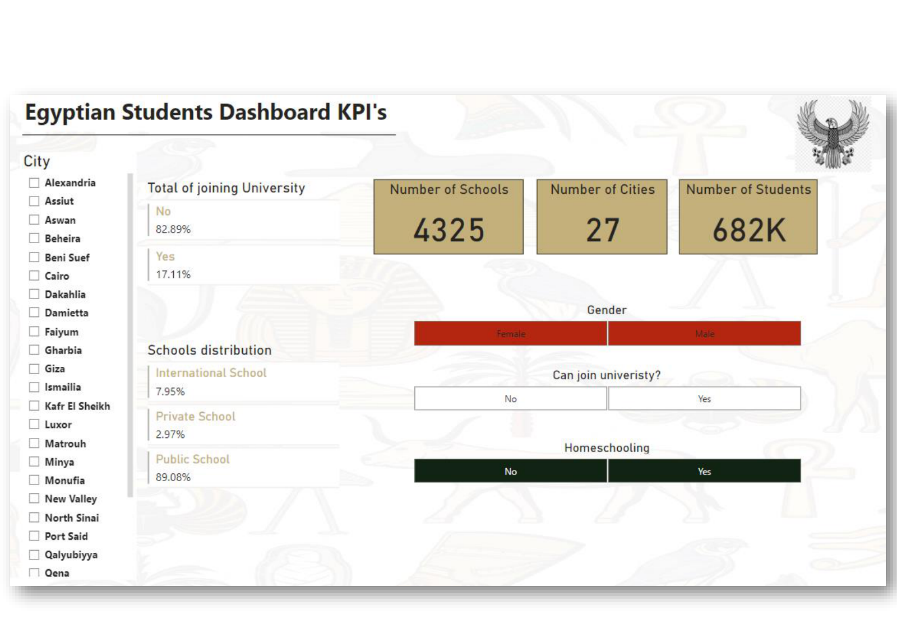
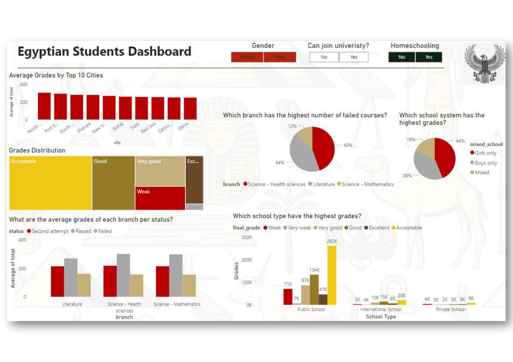
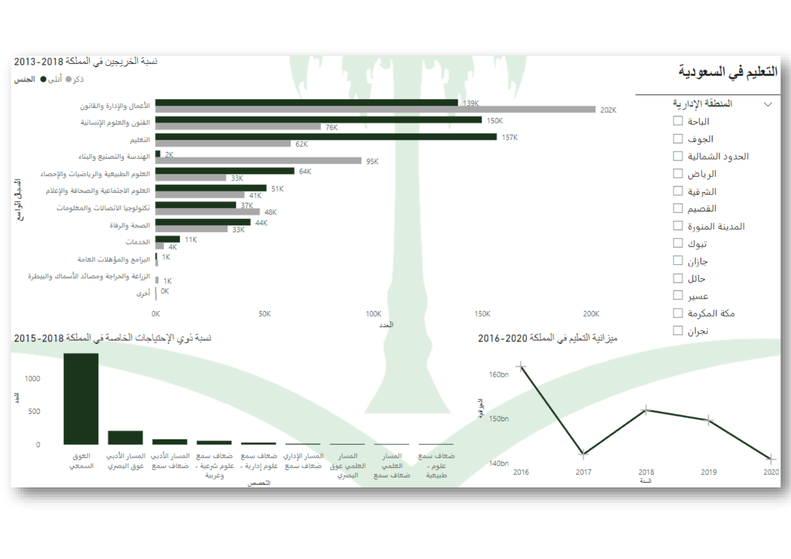
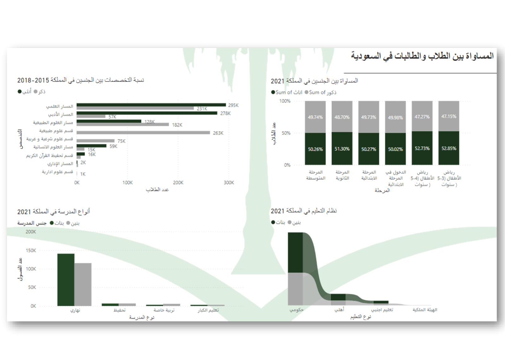
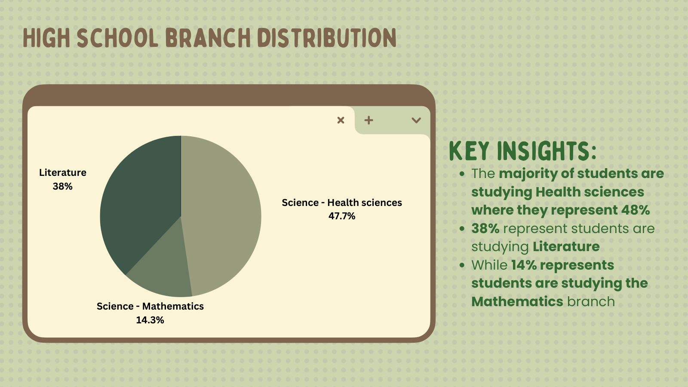
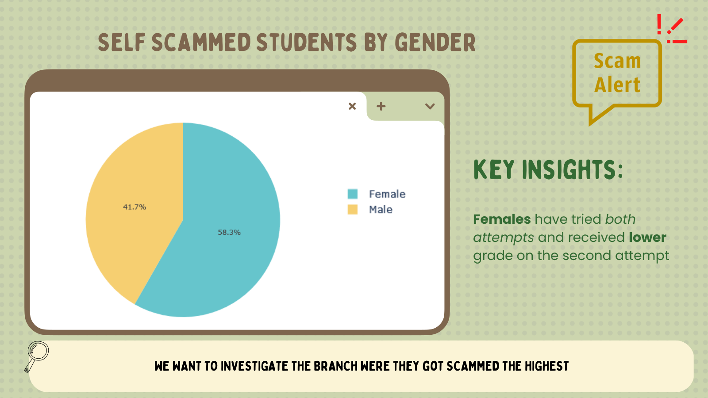
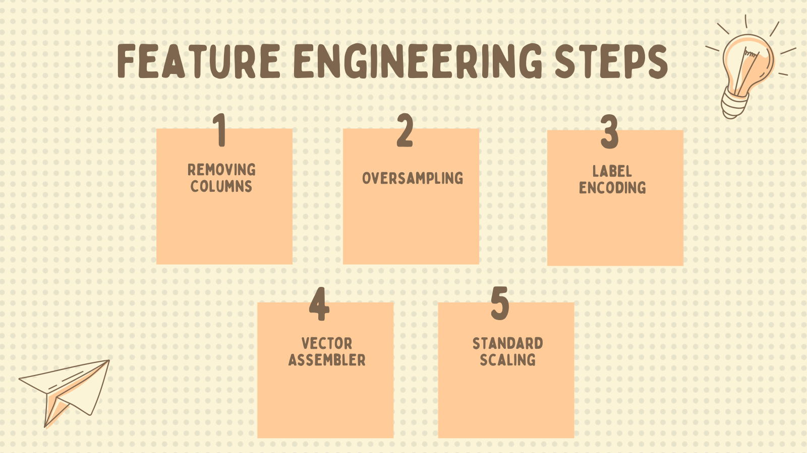
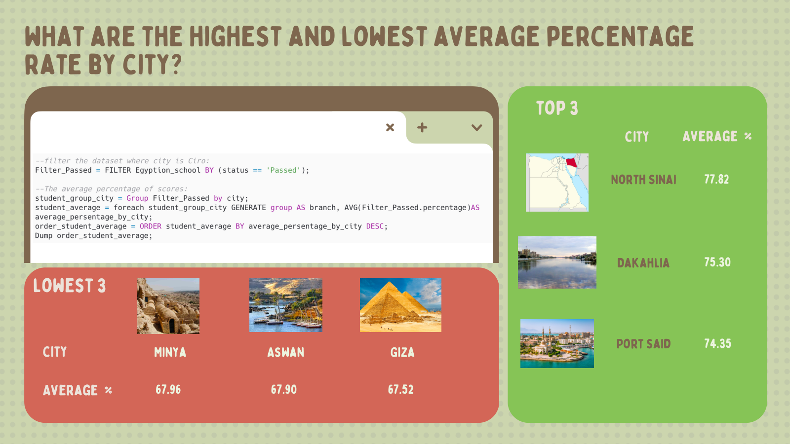
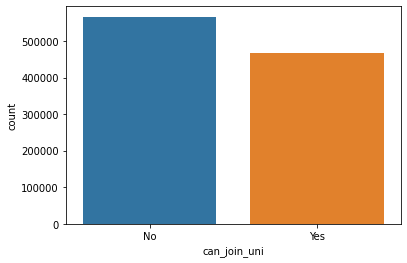
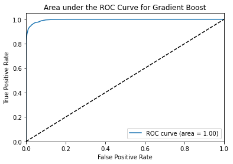

# Egypt University Admission Prediction
---
> Big-data capstone predicting whether **683k+ Egyptian high-school students** can enroll in
> public university from their standardized exam results — full **PySpark** pipeline from
> Arabic-to-English translation through MLlib models, with **Gradient Boosting reaching
> 0.996 ROC-AUC**, plus a Power BI dashboard comparing the Egyptian and Saudi school systems.
> Completed as the capstone of the **Big Data & AI Bootcamp** Big Data track.

## Overview

---
> Using web-scraped results of Egypt's 2022 standardized secondary-school exams (ثانوية عامة),
this project predicts university enrollment eligibility from 45 features: 20+ subject scores,
academic branch (Science–Health, Science–Math, Literature), school type, gender, and retake
attempts. Grade columns were excluded from modeling to avoid data leakage, so predictive
features had to be engineered from what remains — school names, demographics, and attempt
history. The 683k-record dataset was translated from Arabic, cleaned and feature-engineered
in Spark, modeled with four MLlib classifiers, and summarized in an interactive dashboard.

---

> The work is organized as three connected stages:

| Stage | Business Question |
|-------|------------------|
| Preprocessing | How do we translate, clean, and engineer 683k Arabic exam records at scale? |
| Spark SQL EDA | How do branch, gender, school type, and geography shape exam outcomes? |
| MLlib Modeling | Can university enrollment eligibility be predicted from a student's results? |

> Questions we set out to answer along the way:

- Do grades differ between the academic branches, and is the grading curve normally distributed?
- What happens to students who fail or miss an exam — and do scores improve on the second attempt?
- How do students with special needs perform, and how are they supported in each system?
- Is there gender equality in exam outcomes across schools and cities?
- How does Egypt's schooling system compare with Saudi Arabia's?

## Technologies Used
---

- PySpark (Spark SQL & MLlib)
- Python 3
- Pandas
- Plotly
- Power BI
- Jupyter Notebook (Google Colab)

## Key Findings
---

- Translated and standardized 683k+ records (school names, administrations, branches) from Arabic to English with a hybrid manual + automatic approach.
- Engineered features including school type (government/international), gender mix, homeschooling, failed-subject counts, and final grade bands over a 410-point total.
- **Gradient Boosting Trees achieved the best ROC-AUC at 0.9958**, ahead of Random Forest (0.9938), Decision Tree (0.9732), and Logistic Regression (0.7939).
- Enrollment eligibility hinges on the combination of core subject scores and branch specialization, with clear demographic patterns surfaced in the dashboard.

> **Resources:** the original dataset is on
> [Kaggle](https://www.kaggle.com/datasets/81b56c1ff0ae2104ee9ac6af5b0316792232d93acec695e30c5382a0f8650e05?select=High_School_Public_Results_2022_EG_both_attempts.csv),
> and a detailed walkthrough of the preprocessing is in the team's
> [Medium blog post](https://medium.com/@RghdE/educational-landscape-project-a7d675e50c53).
> The preprocessed dataset is committed as gzip to stay within GitHub size limits;
> the raw scraped files are excluded for size. Data is desk-number keyed — no student names.

## Screenshots
---

### Power BI — Egyptian Students Dashboard

---
### Power BI — Saudi Students Dashboard

---
### High School Branch Distribution

---
### Insights by Gender

---
### Feature Engineering Steps

---
### Spark SQL Analysis

---
### Target Class Balance

---
### Winning Model — Gradient Boost ROC Curve

## Team Members
---
- Eman Alamari
- Maha Alhazzani
- Reema Alaswad
- Raghad Aleisa
- Aljohara Alkanhal
